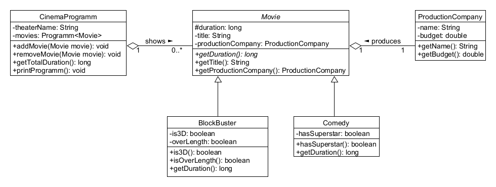

## Übung 3: Relationships

1. Übersetzen Sie das gegebene UML-Diagramm in Java-Code. Datentypen und Zugriffsmodifikatoren sind angegeben. Methoden sollten die Implementierung enthalten, die für die Kompilierung notwendig ist. Bitte beachten Sie, dass die Beziehungen zwischen den Klassen auch einen Zugriffsmodifikator haben. Die Klasse `Movie` und die Methode `getDuration()` sollten als `abstract` deklariert werden, damit sie keine Implementierungen für die abstrakten Methoden bereitstellen müssen.

2. Implementieren Sie bitte die Konstruktoren aller Klassen aus dem UML-Diagramm. Die Konstruktoren sollten alle Attribute der entsprechenden Klassen initialisieren (diese müssen aber nicht unbedingt als Eingabeparameter dienen).

3. Bitte implementieren Sie die Methoden `addMovie(Movie)` in der Klasse CinemaProgramm. Der angegebene Parameter der Methode sollte zur Liste der Filme im CinemaProgramm hinzugefügt werden, aber nur wenn das Budget der Produktionsfirma des Films größer oder gleich 50.000EUR ist.
Implementieren Sie auch die Methode `removeMovie(Movie)`.

4. Bitte implementieren Sie die Methode `getDuration()` der Klassen Blockbuster und Comedy. Die Methode sollte folgende Werte zurückgeben:

   - Blockbuster - `duration` + 20 Minuten, wenn Blockbuster eine 3D-Produktion ist, `duration` + 30 Minuten, wenn die Produktion Überlänge hat
   - Comedy - `duration` + 30 Minuten, wenn die Produktion mit einem Superstar gedreht wurde.

5. Bitte implementieren Sie die Methode `getTotalDuration()` in der Klasse CinemaProgramm. Sie sollte die Summe der Filmdauern aus der Filmliste des CinemaProgramms liefern.

6. Um die Methode `getDuration()` in der Blockbuster-Klasse zu testen, erstellen Sie eine Testklasse namens `BlockbusterTest`. 
Instanziieren Sie zwei Blockbuster-Objekte eines, das einen Film mit Überlänge und nicht in 3D darstellt und das andere, das einen Film mit regulärer Länge und in 3D darstellt.
Schreiben Sie dann zwei Testmethoden: `testGetDurationOverlengthNon3D()`, um die Dauer eines Blockbuster-Films mit Überlänge und nicht in 3D zu überprüfen, und `testGetDurationRegular3D()`, um die Dauer eines Blockbuster-Films mit regulärer Länge und in 3D zu überprüfen. 
Jeder Test sollte sicherstellen, dass die Methode `getDuration()` die korrekte Dauer basierend auf den angegebenen Attributen zurückgibt.

7. Erstellen Sie eine Klasse Test zum Testen der Methode `getTotalDuration()` der Klasse CinemaProgramm. Schreiben Sie mindestens 2 Tests, um eine leere Filmliste und eine Filmliste, die mindestens drei Filme enthält zu testen.